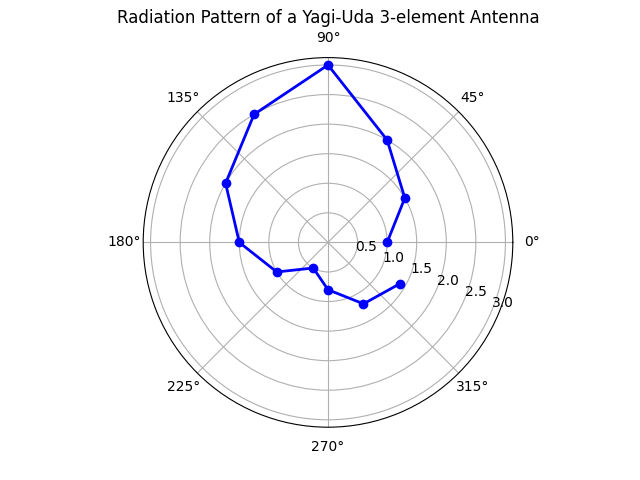

# Yagi-Uda Raditation Pattern Plotting


## Using Python

```bash
import numpy as np
import matplotlib.pyplot as plt


n = int(input("Enter the number of angle readings: "))


angles = []
powers = []

print("Enter angle (in degrees) and power received (in arbitrary units):")
for i in range(n):
    angle = float(input(f"Angle {i+1}: "))
    power = float(input(f"Power {i+1}: "))
    angles.append(angle)
    powers.append(power)


angles = np.radians(angles)


fig, ax = plt.subplots(subplot_kw={'projection': 'polar'})
ax.plot(angles, powers, marker='o', color='b', linestyle='-', linewidth=2)


ax.set_title("Radiation Pattern of a Yagi-Uda 3-element Antenna")
ax.set_rlabel_position(-22.5)  


plt.show()

```

## Terminal Window (This is just Dummy data of Angle & Power not Experiment Accurate)
```bash
Enter the number of angle readings: 12
Enter angle (in degrees) and power received (in arbitrary units):
Angle 1: 0
Power 1: 1
Angle 2: 30
Power 2: 1.5
Angle 3: 60
Power 3: 2
Angle 4: 90
Power 4: 3
Angle 5: 120
Power 5: 2.5
Angle 6: 150
Power 6: 2
Angle 7: 180
Power 7: 1.5
Angle 8: 210
Power 8: 1
Angle 9: 240
Power 9: 0.5
Angle 10: 270
Power 10: 0.8
Angle 11: 300
Power 11: 1.2
Angle 12: 330
Power 12: 1.4
```

## Result

